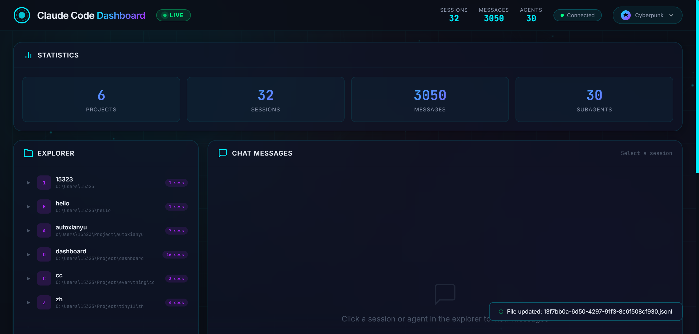
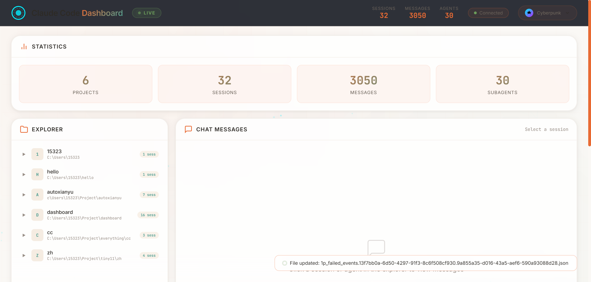

# Claude Code Dashboard

A real-time web dashboard for inspecting Claude Code session data stored in `~/.claude/`. It reads JSONL session files, JSON config files, and history to display projects, sessions, subagent conversations, todos, command history, and activity timelines.



## Features

- **Dual Theme System**: Cyberpunk (dark neon) & Moltbook (warm modern)
- **Real-time Updates**: WebSocket-based live data synchronization with auto-refresh
- **Session Explorer**: Browse projects, sessions, and subagent conversations
- **Chat Messages**: View full conversation history with tool calls
- **Activity Timeline**: Visual chart of daily message activity
- **Todo Tracking**: View and manage Claude Code todos
- **Command History**: Recent command history display
- **Statistics**: Overview of sessions, messages, and agents

## Screenshots

### Cyberpunk Theme (Default)


Dark neon aesthetic with animated particle background and glassmorphism cards.

### Moltbook Theme


Warm modern style with cleaner visual design.

## Installation

```bash
# Clone the repository
git clone git@github.com:Bahtya/claude-code-dashboard.git
cd claude-code-dashboard

# Install dependencies
npm install
```

## Usage

```bash
# Start the server
npm start
```

Visit `http://localhost:3200/` in your browser.

## How It Works

The dashboard reads Claude Code session data from:
- `~/.claude/projects/*/**.jsonl` - Session messages
- `~/.claude/stats-cache.json` - Cached statistics
- `~/.claude/history.jsonl` - Command history
- `~/.claude/todos/*.json` - Todo items
- `~/.claude/settings.json` - User settings

The server uses Chokidar to watch for file changes and broadcasts updates via WebSocket to all connected clients.

## Architecture

**Backend:**
- Express server with WebSocket (ws)
- File watcher (chokidar) for live updates
- API routes for data retrieval

**Frontend:**
- Vanilla JavaScript (no framework)
- Glassmorphism/cyberpunk CSS design
- WebSocket client for real-time updates
- Canvas-based particle animation background

**API Routes:**
- `GET /api/dashboard` - Full aggregated dashboard data
- `GET /api/messages/:projectDir/:sessionId` - Session messages
- `GET /api/subagent-messages/:projectDir/:sessionId/:agentId` - Subagent messages

## Tech Stack

- **Backend:** Node.js + Express + WebSocket (ws) + Chokidar
- **Frontend:** Vanilla JavaScript + CSS3
- **Data Source:** Reads from `~/.claude/` directory

## License

MIT

## Contributing

Contributions are welcome! Please feel free to submit a Pull Request.
