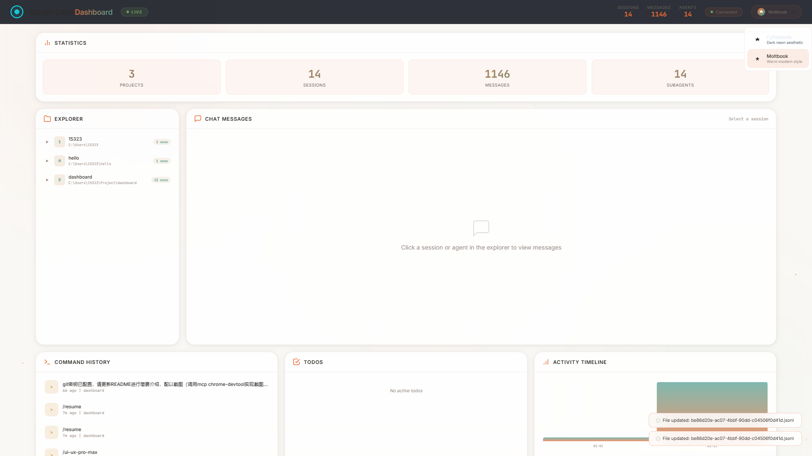

# Claude Code Dashboard

Claude Code 会话数据的实时 Web Dashboard，用于检查存储在 `~/.claude/` 中的会话数据。它读取 JSONL 会话文件、JSON 配置文件和历史记录，显示项目、会话、子代理对话、待办事项、命令历史和活动时间线。



## 功能特性

- **实时更新**：基于 WebSocket 的实时数据同步与自动刷新
- **会话浏览器**：浏览项目、会话和子代理对话
- **聊天消息**：查看包含工具调用的完整对话历史
- **活动时间线**：每日消息活动的可视化图表
- **待办事项追踪**：查看和管理 Claude Code 的待办事项
- **命令历史**：最近的命令历史记录
- **统计概览**：会话数、消息数和代理数的总览

## 安装

```bash
# 克隆仓库
git clone git@github.com:Bahtya/claude-code-dashboard.git
cd claude-code-dashboard

# 安装依赖
npm install
```

## 使用

```bash
# 启动服务器
npm start
```

在浏览器中访问 `http://localhost:3200/`

## 工作原理

Dashboard 从以下位置读取 Claude Code 会话数据：
- `~/.claude/projects/*/**.jsonl` - 会话消息
- `~/.claude/stats-cache.json` - 缓存的统计数据
- `~/.claude/history.jsonl` - 命令历史
- `~/.claude/todos/*.json` - 待办事项
- `~/.claude/settings.json` - 用户设置

服务器使用 Chokidar 监听文件变化，并通过 WebSocket 向所有连接的客户端广播更新。

### Claude Code Agent Teams 通信机制

> 参考资料来源：[Jerome.Y. (@alterxyz4)](https://x.com/alterxyz4/status/2021892207574405386)

Claude Code 的 Agent Teams 功能使用极其朴素的文件系统作为消息队列，没有使用任何消息中间件、数据库或网络通信。

**三大核心原语：**

1. **文件系统消息队列** — 每个 agent 有一个 inbox JSON 文件
2. **AsyncLocalStorage** — Node.js 原生的异步上下文隔离
3. **共享任务列表** — 每个任务一个 JSON 文件

**目录结构：**
```
~/.claude/
├── teams/[团队名]/
│   ├── config.json          # 团队配置和成员列表
│   └── inboxes/
│       ├── team-lead.json   # lead 的收件箱
│       └── observer.json    # teammate 的收件箱
└── tasks/[团队名]/
    └── 1.json               # 任务文件
```

**消息投递机制：**
- 消息只能在 conversation turn 之间投递（非实时）
- teammate 消息被注入为 user message
- 协议消息（如空闲通知、关闭请求）序列化为 JSON 字符串存入 text 字段
- inbox 文件按需创建，每条消息追加到 JSON 数组末尾

**两种运行模式：**
| 模式 | 说明 |
|------|------|
| in-process | 主进程内，AsyncLocalStorage 隔离上下文 |
| tmux | 独立 tmux pane，完全独立进程 |

**已知限制：**
- 没有实时性（消息只能在 turn 间投递）
- 没有同步等待（不能 `await teammate.confirm()`）
- Context compaction 会杀死团队感知
- 多个 teammate 同时写 MEMORY.md 会互相覆盖

详细文档见：[docs/claude-code-agent-communication.md](docs/claude-code-agent-communication.md)

## 架构

**后端：**
- Express 服务器 + WebSocket (ws)
- 文件监控器 (chokidar) 实现实时更新
- API 路由用于数据检索

**前端：**
- 原生 JavaScript（无框架）
- 玻璃拟态/赛博朋克 CSS 设计
- WebSocket 客户端实现实时更新
- Canvas 粒子动画背景

**API 路由：**
- `GET /api/dashboard` - 完整的聚合 Dashboard 数据
- `GET /api/messages/:projectDir/:sessionId` - 会话消息
- `GET /api/subagent-messages/:projectDir/:sessionId/:agentId` - 子代理消息

## 技术栈

- **后端：** Node.js + Express + WebSocket (ws) + Chokidar
- **前端：** 原生 JavaScript + CSS3
- **数据源：** 读取 `~/.claude/` 目录

## 许可证

MIT
